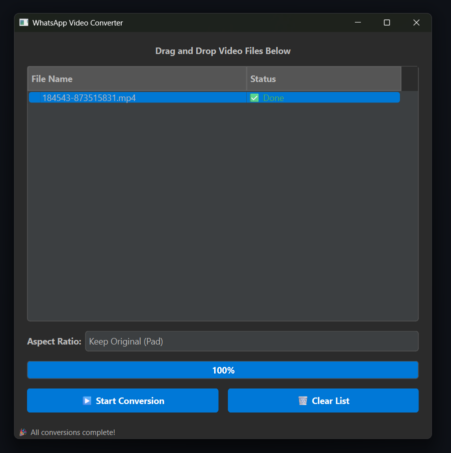

# WhatsApp Video Converter HD



A sleek, modern desktop application designed to convert your videos into a high-quality format that bypasses WhatsApp's aggressive video compression. Send videos that look sharp and clear, exactly as you intended.

---

## The Problem

Have you ever recorded a beautiful, high-resolution video on your phone, only to have it look like a pixelated mess after sending it through WhatsApp?

WhatsApp heavily compresses videos to save data and speed up transfers, which often ruins the quality. This tool re-encodes your videos with very specific settings that meet WhatsApp's criteria for an "uncompressed" file, ensuring your videos are sent in the best possible quality.

## ✨ Features

* **Bypass WhatsApp Compression:** The core feature! Encodes videos to look great on WhatsApp.
* **Sleek Dark Mode UI:** An easy-on-the-eyes interface built with PyQt6.
* **Drag & Drop:** Simply drag your video files into the application to add them to the queue.
* **Smart Crop & Pad:** Intelligently handles different video orientations and aspect ratios.
    * **Keep Original (Pad):** Adds black bars to fit the frame without cropping.
    * **Crop to Fit:** Smartly crops the video to fit modern screen sizes (16:9, 9:16, 1:1, etc.) without stretching or distorting the image.
* **High-Quality Encoding:** Uses a two-pass `veryslow` preset with the `x264` codec to maximize quality and compression efficiency for the given bitrate.
* **Batch Processing:** Convert multiple videos at once with a clear progress bar.

## 🛠️ Prerequisites

Before you begin, ensure you have the following installed on your system:

1.  **Python 3:** Download from [python.org](https://www.python.org/downloads/).
2.  **FFmpeg & FFprobe:** This is essential for the video processing.
    * **Windows:** Download from [ffmpeg.org](https://ffmpeg.org/download.html) and add the `bin` folder to your system's PATH.
    * **Linux (Ubuntu/Debian):**
        ```bash
        sudo apt update && sudo apt install ffmpeg
        ```

## 🚀 Installation & Usage

Follow these steps to get the application running on your local machine.

1.  **Clone the repository:**
    ```bash
    git clone [https://github.com/your-username/your-repository-name.git](https://github.com/your-username/your-repository-name.git)
    cd your-repository-name
    ```

2.  **Create and activate a virtual environment:**
    * **On Windows (PowerShell):**
        ```powershell
        python -m venv venv
        .\venv\Scripts\activate
        ```
    * **On Linux/macOS:**
        ```bash
        python3 -m venv venv
        source venv/bin/activate
        ```

3.  **Install the required Python packages:**
    ```bash
    pip install PyQt6
    ```

4.  **Run the application:**
    ```bash
    python main.py  # Or whatever you name the main script
    ```

5.  **Convert your video(s):**
    * Drag and drop your video files into the window.
    * Select your desired aspect ratio.
    * Click "▶️ Start Conversion".
    * The converted files will be saved in the same directory as the original files, with `_whatsapp` appended to the filename.

6.  **Send the Video!**
    * **⚠️ Important:** To ensure the video is not re-compressed, you **must** send the converted file using **WhatsApp Web** in your browser.
    * Sending the video from the mobile app or the Windows/macOS desktop app will likely trigger WhatsApp's compression algorithm again, defeating the purpose of this tool.

## ⚙️ How It Works

The script uses `ffmpeg` with a carefully selected set of parameters to perform a two-pass video encode.

* **Two-Pass Encoding:** The first pass analyzes the video to determine the optimal way to distribute the bitrate. The second pass uses this information to perform the actual encoding, resulting in a much more efficient and higher-quality file compared to a single pass.
* **`veryslow` Preset:** This setting tells the `x264` encoder to use its most advanced algorithms to maximize compression efficiency. It takes longer, but for a powerful PC like a Ryzen 5800x, it delivers a noticeable quality improvement without increasing the file size.
* **Bitrate Control:** The video bitrate is capped at `3100k` with a max rate of `3200k`. This is a sweet spot that provides excellent quality for 1080p-scaled video while staying within the limits that WhatsApp is less likely to re-compress.
* **Smart Filters (`-vf`):** The script dynamically generates a filter chain that first crops the video (if selected) and then scales it to the target resolution, ensuring no distortion.

## 📄 License

This project is licensed under the MIT License. See the `LICENSE` file for details.
